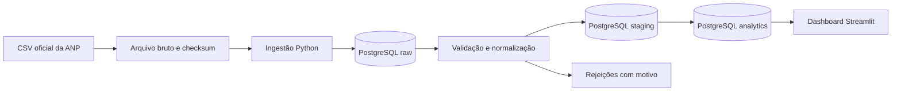

# FuelScope

Projeto de portfólio de engenharia de dados e ciência de dados com dados públicos de preços de combustíveis da ANP.

**Status:** planejamento e estrutura inicial. O pipeline, o banco e o dashboard ainda não estão implementados.

## Objetivo

Acompanhar a evolução dos preços observados, comparar municípios e estimar o custo de abastecimento para uma quantidade de litros. O projeto será desenvolvido em pequenas entregas, com rastreabilidade, testes e execução reproduzível.

O recorte inicial proposto é Paraíba e gasolina comum. A cobertura e o período serão confirmados na primeira atividade. Os resultados representam a amostra pesquisada pela ANP; não garantem preços atuais de todas as revendas.

## Perguntas do produto

- Como os preços observados evoluíram por semana?
- Qual foi a variação em relação à semana anterior?
- Como os municípios pesquisados se comparam, considerando a cobertura?
- Qual é a dispersão dos preços em cada município?
- Quanto custaria comprar uma quantidade informada de litros?

## Arquitetura planejada do MVP



Stack planejada: Python, Pandas, PostgreSQL, SQL, Streamlit, Docker Compose, Pytest e GitHub Actions. FastAPI, orquestração, previsão e deploy entram após estabilização do MVP.

## Estrutura

```text
src/fuelscope/        # ingestão, transformação, qualidade, banco e CLI
dashboard/           # visualização futura
sql/migrations/      # evolução do esquema
sql/analytics/       # consultas e métricas
tests/fixtures/      # entradas pequenas para testes
data/sample/         # amostra pública documentada
docs/decisions/      # decisões técnicas
.github/ISSUE_TEMPLATE/ # formulário de atividade
```

## Desenvolvimento

Ainda não há comandos de execução da aplicação. Eles serão adicionados e verificados nas entregas de ambiente e pipeline. Não é necessário instalar toda a stack nesta etapa.

Comece pelo [backlog](docs/backlog.md), atividade 01. O [guia de trabalho](CONTRIBUTING.md) explica como concluir uma tarefa e registrar evidências.

## Evolução

1. MVP: um estado, ingestão manual, qualidade, PostgreSQL e dashboard.
2. Expansão: carga nacional incremental, agendamento e API.
3. Experimentos: previsão temporal contra baselines, alertas de anomalias, monitoramento e deploy.

Modelos só serão incluídos com pergunta clara e backtesting temporal. MAE em R$/litro será a métrica principal; MAPE será complementar. Nenhuma transformação poderá usar informações futuras.

## Fonte e limitações

[Série histórica por revenda — ANP](https://www.gov.br/anp/pt-br/centrais-de-conteudo/dados-abertos/serie-historica-de-precos-de-combustiveis).

Cada resultado deverá informar período, unidade, quantidade de observações e revendas. Arquivos brutos completos e credenciais não serão versionados. A amostra será incluída após inspeção da fonte.

## Autor

Gustavo Henrique Rocha Oliveira.
